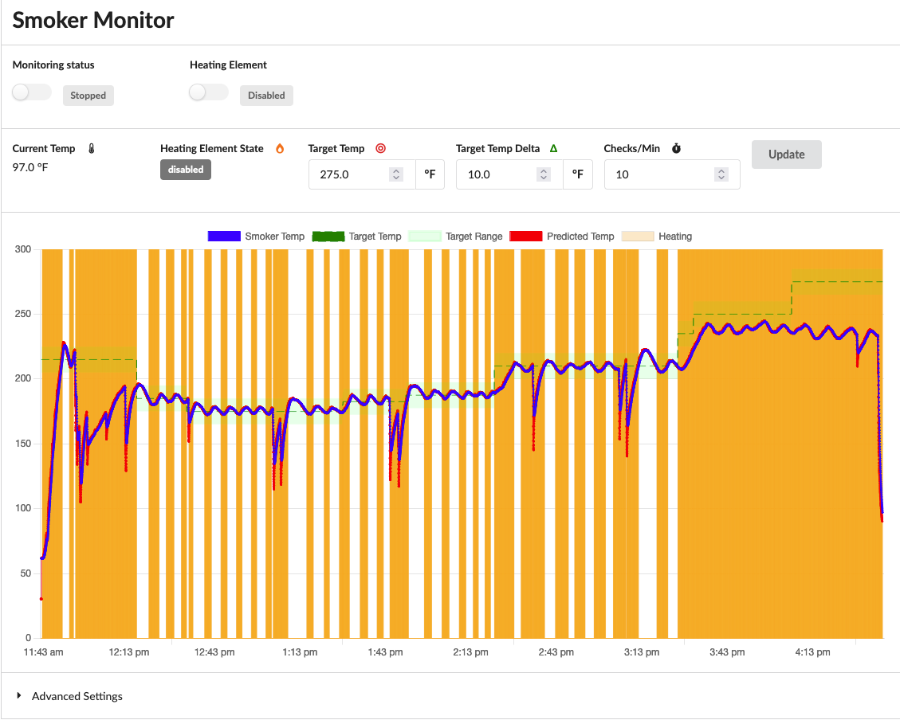

# SmokoTime

SmokoTime is a project to improve the temperature control of a cheap electric smoker.  The smoker that I have has a crude controller for the heating element that doesn't provide a temperature setting.  The end result is that it is very hard to get a desired set temperature and the temperature varies pretty wildly.

The solution here is to use a Raspberry Pi to monitor the temperture inside the smoker and then provide external control to the heating element to switch it on and off as needed.  This allows for a bit more intelligence in the control and allows for tracking of the temperature over time.

## How does this all work?

As mentioned above, a Raspberry Pi is the brains of the operation:
 * It runs the SmokoTime software that allows for setting of target temperature and heating status.
 * Smoker temperature is monitored via a [K-type thermocouple](https://www.auberins.com/index.php?main_page=product_info&cPath=20_3&products_id=327).
 * The thermocouple is connected to the Pi via an [Adafruit MAX31856 thermocouple amplifier](https://www.adafruit.com/product/3263).
 * The heating element is controlled very simply using a WiFi outlet connected to [Home Assistant](https://home-assistant.io) (HA).  SmokoTime instructs HA to turn the outlet on and off.
 * Temperature and switch status is graphed in the SmokoTime UI for the user to see.

## Running

Simply run `python3 SmokoTime.py` or `./SmokoTime.py` and then connect to the system via a web browser.

## Challenges

### Performance

The biggest challenge at this point is a performance problem with charting of data over many hours.  [Chart.js](https://www.chartjs.org/) is used for charting and it has trouble with large datasets.  There are ways to help with this, but they haven't been tried yet.

### Temperature Control

In general, temperature control works well.  But, there are two situations where it has some issues:

* When first putting the meat in the smoker, it has trouble recovering from the heat loss due to the door opening and the decrease due to a large piece of cold meat being put in.  I've found that I need to adjust the temperature down a bit so that it can better catch up and then work to approach the target temperature again.  There's a couple possible reasons for this:
  * This could just be a patience issue on my part and I just need to wait.
  * The placement thermocouple relative to what rack the meat is on matters.  If the meat is too close to the thermocouple, it throws off the reading.

* Over a long cook, the smoker seems to have trouble maintaining temperature at the end.  I'm not sure why this is, but I suspect that it might be related to buildup on the tip of the oven's controller for the heating element.  I think there's a temperature sensor in there and when it gets goopy, it doesn't read right.  Keeping this clean and shielded may help.  Generally, when this happens, it's later in the cook and at a point that smoke isn't needed any more, so I can just evacuate to the oven in the kitchen.